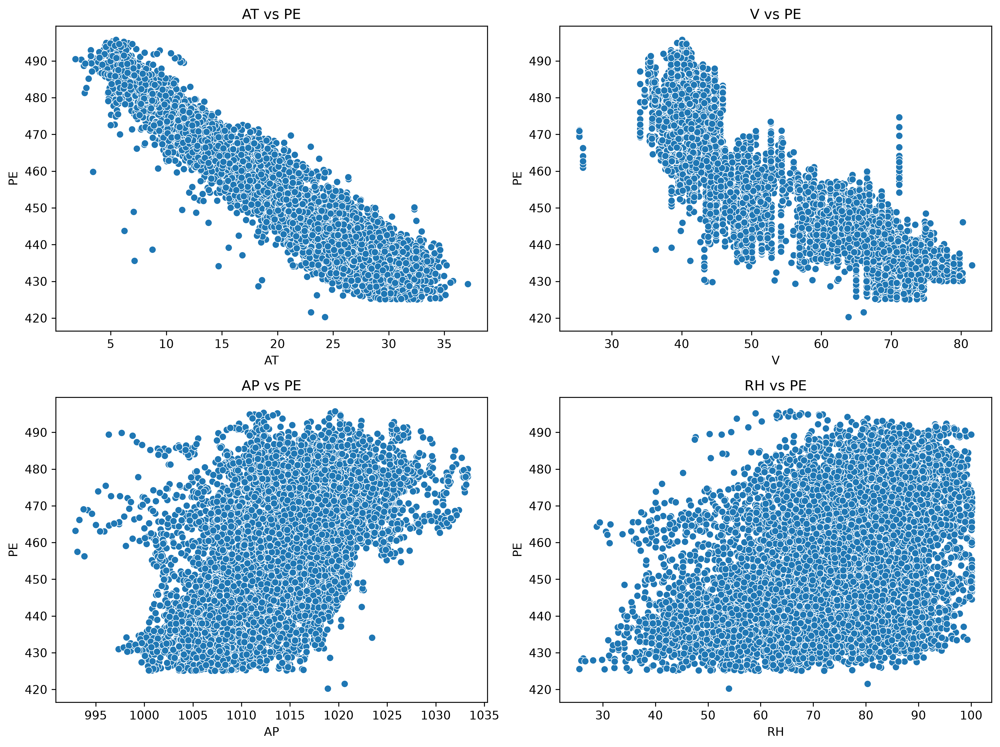
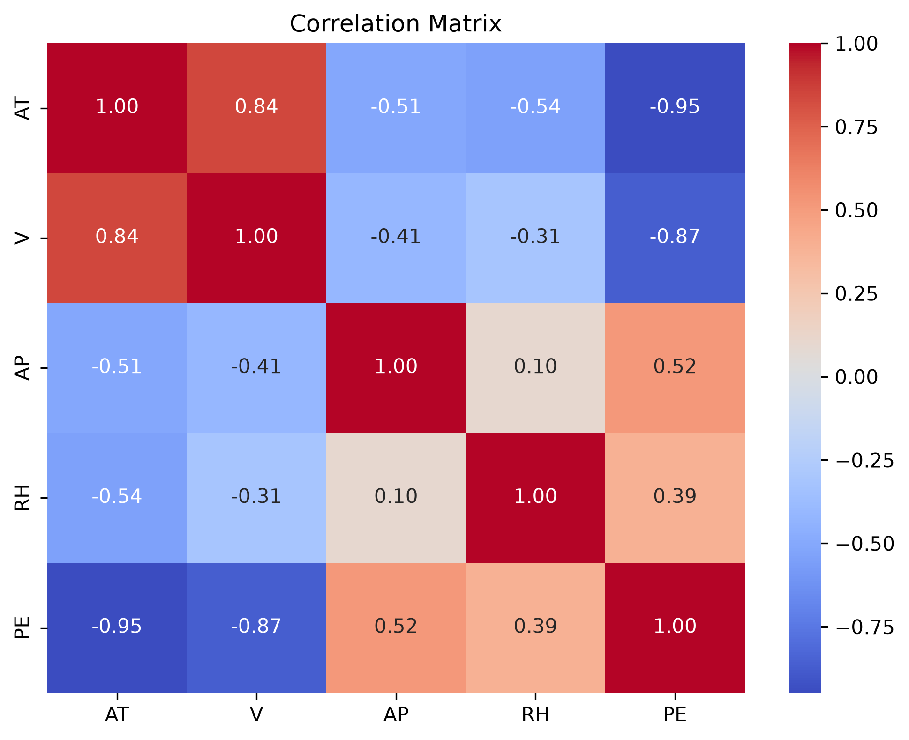
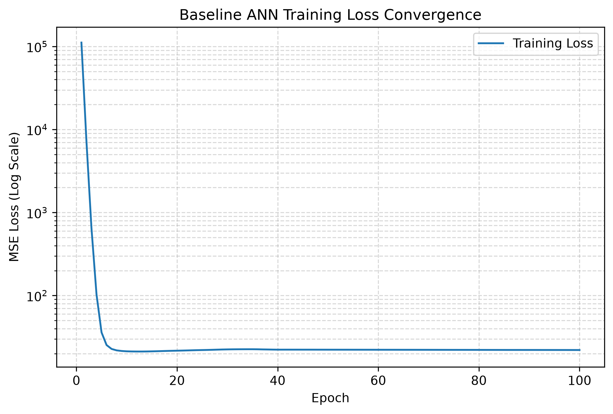
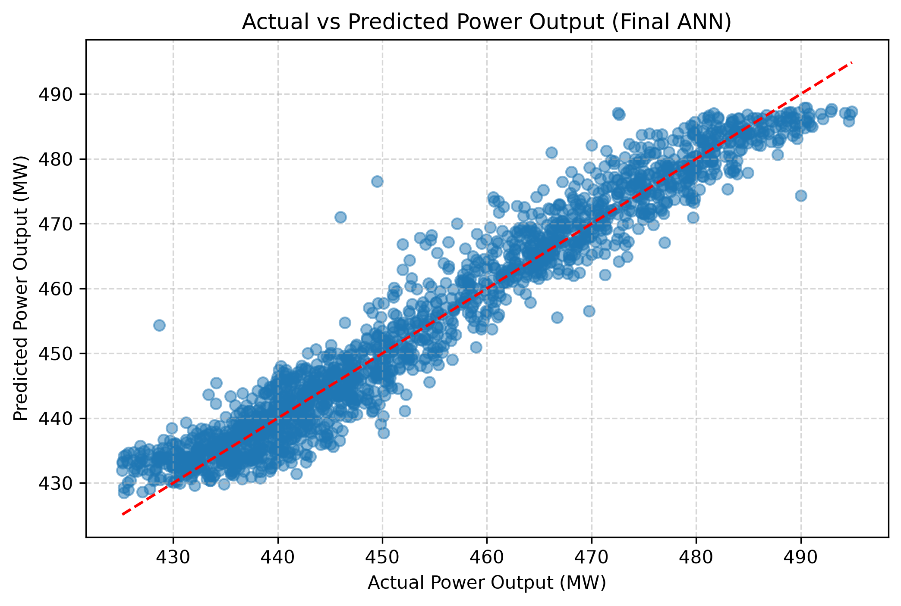
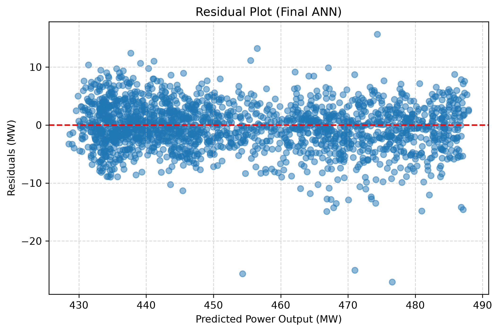

# PowerNet — Optimized ANN-Based Power Plant Energy Output Prediction

PowerNet is an end-to-end Machine Learning project that leverages an **Artificial Neural Network (ANN)** to predict the net hourly electrical power output (**PE**) of a Combined Cycle Power Plant (CCPP) using ambient environmental sensor readings.

The project implements a clean, leak-free **Scikit-Learn and Skorch (PyTorch)** pipeline, evaluates hyperparameter spaces through **GridSearchCV** and **Optuna (TPE Bayesian Optimization)** with 5-fold cross-validation, and achieves high predictive accuracy on unseen test data.

---

## Objective

Develop, optimize, and evaluate a fully reproducible ANN regression pipeline that reliably predicts base-load electrical power output (in Megawatts, MW) under fluctuating ambient conditions, minimizing Root Mean Squared Error (RMSE) and Mean Absolute Error (MAE).

---

## Dataset & Features

The dataset originates from the **UCI Machine Learning Repository** (Combined Cycle Power Plant dataset), containing 9,568 hourly average observations collected across six years (2006–2011) when the plant was operating at full capacity.

- **Preprocessing**: 41 duplicate records were identified and removed, yielding 9,527 unique records.
- **Split Strategy**: 80% training set (7,621 samples) and 20% untouched final test set (1,906 samples) partitioned with `random_state=42`.

### Feature Description

| Variable | Name | Description | Range |
| :--- | :--- | :--- | :--- |
| **AT** | Ambient Temperature | Atmospheric temperature surrounding the plant | 1.81 °C – 37.11 °C |
| **V** | Exhaust Vacuum | Steam turbine vacuum pressure | 25.36 cm Hg – 81.56 cm Hg |
| **AP** | Ambient Pressure | Atmospheric air pressure | 992.89 mbar – 1033.30 mbar |
| **RH** | Relative Humidity | Ambient humidity percentage | 25.56% – 100.16% |
| **PE** *(Target)* | Net Hourly Electrical Output | Electrical energy output produced by the plant | 420.26 MW – 495.76 MW |

---

## Exploratory Data Analysis

Ambient Temperature (`AT`) and Exhaust Vacuum (`V`) display strong negative linear correlations with Electrical Power Output (`PE`), demonstrating that thermodynamic efficiency increases at lower ambient temperatures and lower exhaust vacuum.



The correlation heatmap confirms these physical dynamics:
- `AT` vs `PE`: **-0.95** (primary driver of energy generation)
- `V` vs `PE`: **-0.87**
- `AP` vs `PE`: **+0.52**
- `RH` vs `PE`: **+0.39**



---

## ANN Architecture & Pipeline

The neural network is built using **PyTorch** and wrapped in **Skorch** to integrate seamlessly into a standard Scikit-Learn `Pipeline`.

```
[Input: 4 Features] 
       │
       ▼
[StandardScaler] ──► [FunctionTransformer(float32)]
       │
       ▼
[Linear(4 → hidden_size)] ──► [Activation: ReLU / Tanh]
       │
       ▼
[Linear(hidden_size → hidden_size)] ──► [Activation: ReLU / Tanh]
       │
       ▼
[Linear(hidden_size → 1)] ──► [Predicted Output: PE (MW)]
```

- **Pipeline Design**: `StandardScaler` is positioned inside the pipeline to prevent data leakage during cross-validation folds.
- **Loss Function**: Mean Squared Error (`nn.MSELoss`).
- **Skorch Setting**: `train_split=None` ensures Scikit-Learn's `KFold` cross-validation directly manages training/validation splits.

---

## Baseline ANN

Before hyperparameter optimization, a baseline model was trained using initial default parameters:
- Architecture: 2 hidden layers with 6 neurons each, `ReLU` activation
- Optimization: `Adam`, learning rate `0.01`, batch size `32`, 100 epochs
- **Baseline Final Training MSE**: 22.0640



---

## Hyperparameter Optimization

### 1. GridSearchCV Baseline Experiment
An initial exhaustive grid search was conducted across **80 candidate configurations** using 5-fold cross-validation (**400 total fits**):
- Evaluated parameters: `hidden_size` ([4, 6, 8, 12, 16]), `activation` ([ReLU, Tanh]), `optimizer` ([Adam, RMSprop]), `lr` ([0.001, 0.01]), and `batch_size` ([32, 64]).
- **Best Parameters**: `hidden_size=12`, `activation=ReLU`, `optimizer=Adam`, `lr=0.001`, `batch_size=32`.
- **Best 5-Fold CV RMSE**: **4.4037 MW**.

### 2. Optuna Bayesian Optimization (Primary Method)
To search continuous parameter spaces and discover more optimal architectures efficiently, **Optuna (Tree-structured Parzen Estimator / TPE)** was deployed with 5-fold cross-validation over 30 adaptive trials:
- `hidden_size`: Integer range [4, 32]
- `activation`: Categorical `['ReLU', 'Tanh']`
- `optimizer`: Categorical `['Adam', 'RMSprop']`
- `lr`: Log-uniform float range [1e-4, 1e-2]
- `batch_size`: Step range [32, 128] (step 16)
- **Best 5-Fold CV RMSE**: **4.2106 MW** (outperforming GridSearchCV by 0.1931 MW).

### Final Optuna Hyperparameters
The optimal configuration identified by Optuna and deployed to the final model:

| Hyperparameter | Optimal Value |
| :--- | :--- |
| **Hidden Layer Size** | **29 neurons** (2 hidden layers) |
| **Activation Function** | **Tanh** (`nn.Tanh`) |
| **Optimizer** | **RMSprop** (`optim.RMSprop`) |
| **Learning Rate** | **0.007467** |
| **Batch Size** | **32** |
| **Training Epochs** | **100** |

---

## Final Evaluation & Test Results

The unified `ann_pipeline` was reconfigured with all optimal Optuna parameters, retrained on the entire training set (`X_train`), and evaluated on the untouched test set (1,906 samples):

| Metric | Baseline ANN | **Final Optimized ANN** | Absolute Improvement |
| :--- | :---: | :---: | :---: |
| **MAE** | 3.5587 MW | **3.0780 MW** | **-0.4807 MW** |
| **MSE** | 20.4061 | **16.3761** | **-4.0300** |
| **RMSE** | 4.5173 MW | **4.0467 MW** | **-0.4706 MW** |
| **R² Score** | 0.9324 | **0.9457** | **+0.0133** |

### Actual vs. Predicted Output
Predictions show tight alignment along the identity line ($y = x$) across the entire operating spectrum (420 MW – 495 MW), confirming an $R^2$ of **0.9457**.



### Residual Analysis
Residual errors (Actual − Predicted) are centered near zero with variance bounded within ±10 MW, demonstrating stable homoscedastic behavior without severe systemic bias.



---

## Project Structure

```
PowerNet/
├── images/
│   ├── actual_vs_predicted.png    # Test set Actual vs Predicted scatter plot
│   ├── correlation_heatmap.png     # Feature correlation matrix heatmap
│   ├── feature_vs_target.png       # Environmental features vs PE relationships
│   ├── residual_plot.png           # Residual analysis plot
│   └── training_loss.png           # Baseline ANN training loss curve (log scale)
├── .gitignore                      # Git ignore file for environments and caches
├── powerplant.ipynb                # Complete end-to-end Jupyter Notebook
├── powerplant_data.csv             # Combined Cycle Power Plant dataset
└── README.md                       # Project documentation and summary
```

---

## Technologies Used

- **Python 3.10+**
- **PyTorch** (`torch`, `torch.nn`, `torch.optim`) — Deep learning architecture
- **Skorch** (`skorch.NeuralNetRegressor`) — Scikit-Learn wrapper for PyTorch
- **Scikit-Learn** (`Pipeline`, `StandardScaler`, `KFold`, `cross_val_score`, metrics)
- **Optuna** — Tree-structured Parzen Estimator (TPE) hyperparameter optimization
- **Pandas & NumPy** — Data manipulation and numerical operations
- **Matplotlib & Seaborn** — Scientific data visualization and EDA

---

## How to Run

1. **Clone the Repository**:
   ```bash
   git clone https://github.com/<your-username>/PowerNet.git
   cd PowerNet
   ```

2. **Create and Activate a Virtual Environment**:
   ```bash
   python -m venv venv
   # On Windows:
   venv\Scripts\activate
   # On Linux/macOS:
   source venv/bin/activate
   ```

3. **Install Required Packages**:
   ```bash
   pip install torch skorch optuna scikit-learn pandas numpy matplotlib seaborn
   ```

4. **Launch the Jupyter Notebook**:
   ```bash
   jupyter notebook powerplant.ipynb
   ```
   Select **Run All Cells** to execute the pipeline from start to finish.
